# Trida AI

## Blueprint — Logistics Shipment Exception Agent

It turns one shipment record into a classified exception, a policy-cited
customer-update draft, and a claim-packet draft — then waits for a human
decision.

<p>
  
  
  
</p>

> **Reference prototype.** An open blueprint from Trida AI showing how a
> forward-deployed engineering team builds an AI agent for a real
> operational workflow. It runs on **synthetic data only**, stops at a
> human-approval gate, and takes **no external action** (one opt-in
> exception: an approval webhook you configure yourself — see
> Configuration). It is not a production system and does not describe
> any client engagement.

## Try it in 3 commands

Once the repository is cloned and dependencies are installed, the demo
and tests run locally with no API key. The primary workflow is
**[uv](https://docs.astral.sh/uv/)**, using the versions in `uv.lock`:

**Supported Python: 3.10 – 3.12** (macOS and Linux).

```bash
uv sync --extra dev              # 1 · install the locked set (uv.lock)
uv run shipment-agent-demo       # 2 · one shipment, end to end, with a trace
uv run pytest -q                 # 3 · the full test suite (205 tests)
```

No uv? Create a virtual environment and use pip. The direct dependencies
are pinned, and `constraints.txt` freezes the tested transitive set:

```bash
python3 -m venv .venv
source .venv/bin/activate
pip install -e ".[dev]" -c constraints.txt
python -m shipment_agent demo
pytest -q
```

Real excerpt from the demo's output:

```text
[2] CLASSIFICATION
    Exception : delay
    Severity  : high   Confidence: 0.94
    Evidence (signals):
      - delay signal: delay_hours=36.0
      - delay signal: delayed
      - delay signal: weather hold

[5] RECOVERY OPTIONS (scored by code — the model never does this arithmetic)
    OPT-1 [expedite] Expedite the remaining leg — score 59.81 (ETA +32.8h · added cost 148.2 units · SLA 0.85) <- recommended
    OPT-2 [reroute] Reroute via the alternate hub — score 52.84 (ETA +20.0h · added cost 70.6 units · SLA 0.75)
    OPT-3 [wait_and_monitor] Hold and monitor — score 6.72 (ETA +0.0h · added cost 0.0 units · SLA 0.112)

[8] SELF-VERIFICATION — the agent critiques its own draft
    verdict: GROUNDED (deterministic checklist)
    Checklist: every citation, figure, and reference in the draft matches the verified facts.

[9] GUARDRAIL CHECKS
    [PASS] references_shipment_id — Draft references shipment SYN-1001.
    [PASS] no_prohibited_promises — No prohibited promise phrases found.
    [PASS] policy_citations_present — Cites 3 policy citation(s): POL-DELAY-01, POL-COMM-01, POL-DMG-01.
    [PASS] states_next_step — Draft states the next update / next step.
    Overall: PASSED

[10] FINAL STATE
    PENDING_HUMAN_APPROVAL
    approval_status = awaiting_approval · external_action_taken = False
    Autonomy recommendation: human decision required (recommendation only — never acted on)
      - exception 'delay' at severity 'high' is above the auto-approval band (none or low) — a human should decide
```

Prefer a browser? Run `make serve` and
open http://localhost:8000/ — pick a sample shipment, click **Analyze**,
review the draft and guardrail checks, then **Approve** or **Reject**.
`make demo`, `make test`, `make evals`, and `make serve` wrap the common
commands.

## The problem

When a shipment goes wrong — it's delayed, damaged, its documents don't
agree, or a delivery appointment is missed — someone in operations has to
notice, work out which kind of exception it is, check the governing policy,
draft a correct customer update, and assemble a claim packet. Multiplied by
every exception, every day, that follow-through is where logistics teams
lose hours and consistency.

## What this agent does

For one shipment, end to end — a ten-node LangGraph pipeline where the
model does language work and code does every number:

1. **Extracts** document fields (bill of lading, invoice, event text):
   with an LLM backend, the model extracts typed fields with per-field
   confidences; deterministic code cross-checks them against the
   provided fields and records every discrepancy. In the default mode
   the provided fields pass through, marked source-provided.
2. **Ingests** the shipment record and computes the facts — delay hours,
   field-level document mismatches — with code, never with a model.
   Intake is normalised first (document-type aliases, numeric field
   values — see the intake contract below), and when no BOL/invoice
   pair exists the result carries an explicit warning that the
   mismatch check was skipped; it is never silently absent.
3. **Classifies** the exception — `delay`, `damage`, `document_mismatch`,
   `missed_appointment`, or `none`. Deterministic rules run
   independently; with a provider configured, the LLM classifies
   independently too, and the two are **cross-checked** under one
   explicit resolution policy (below) that the approver can see.
4. **Retrieves** policy context from the synthetic SOP corpus: keyword,
   semantic (embeddings), or **hybrid** — both candidate sets merged,
   deduplicated, and reranked by reciprocal-rank score fusion to the
   cited top-3. The query is built from the shipment's **own content**
   — exception type, the latest event text, condition notes, and
   document field values — so a policy written in operational language
   ranks for the case it describes, not just for the classifier's
   wording.
5. **Diagnoses** the root cause over the computed evidence — computed
   delay, document diffs, extraction discrepancies, retrieved policy
   IDs — composed by the LLM in provider mode, by a template over the
   same evidence structure in default mode. The evidence also carries
   **memory**: prior analysed shipments for the same consignee and the
   same lane, counted from the store ("2 prior exception(s) for this
   consignee in the stored history"), so a repeat problem is visible
   as a repeat.
6. **Proposes recovery options** (2–3: expedite, reroute, reschedule,
   correct the documents, …) and **scores them in deterministic code**
   from the delay and severity — ETA improvement, added cost, SLA
   impact. The model never does this arithmetic; the highest score is
   the recommendation the draft grounds on.
7. **Drafts** a customer update and a claim packet, with policy
   citations, the diagnosis, and the scored options.
8. **Verifies its own draft** against the verified facts and cited
   policies: an LLM critique in provider mode, a deterministic evidence
   checklist in default mode (labelled as such) — verdict and issues
   land in the result, the trace, and the claim packet.
9. **Validates** the draft against guardrails implemented as code (no
   promised compensation, no missing citations, no missing shipment
   ID). On failure, a **bounded repair loop** redrafts once (default;
   `GUARDRAIL_REPAIR` configurable) with the failure reasons and
   self-verification issues fed back, then re-verifies and
   re-validates. The original failure stays on the result either way.
10. **Stops.** The result sits at `awaiting_approval`, carrying a
    deterministic **autonomy recommendation** (eligible for
    auto-approval only for none/low-severity cases with passing
    guardrails, no cross-check disagreement, and no repair — a printed
    recommendation, never an action). Nothing is sent, filed, or
    posted anywhere — a human approves first.

**The classification resolution policy** (implemented in
`crosscheck.py`, shown in the result and the trace): rules are
authoritative on disagreement — **except** when the rules land on
`none` or below 0.85 confidence while the LLM is at 0.85 confidence or
above on a concrete type; then the LLM result is adopted and flagged
`llm_adopted` in the classification's signals and rationale, so the
approver always knows which path decided.

## Who it's for

- **3PLs, carriers, and shipper operations teams** evaluating how an
  exception-handling agent should be structured before anyone builds one
  against real systems.
- **Engineers** who want a testable LangGraph reference implementation —
  graph, schemas, guardrails, evals, API, and tests — instead of a notebook.

## Take it and make it yours

Use these seams to adapt it — each is one file or one setting:

- **Real LLM, cloud or local** — install the optional SDKs
  (`uv sync --extra dev --extra llm`), copy `.env.example` to `.env`, and
  set `MODEL_BACKEND=openai`, `anthropic`, or `ollama` (a local model —
  no key, nothing leaves the machine). Every surface honours the same
  variables, and the provider runs the *whole* pipeline — extraction,
  classification cross-check, diagnosis, options, drafting — not a
  single prompt. The deterministic mock remains only as the **offline
  fallback**. Backend interface: `src/shipment_agent/model_backends.py`.
- **Hybrid retrieval + local vectors** — `RETRIEVER=keyword|semantic|hybrid`.
  Hybrid merges keyword and semantic candidates and reranks them by
  reciprocal-rank fusion. With the `vectordb` extra installed, semantic
  search runs on a local **Chroma** store (embedded, or a server via
  `CHROMA_HOST`); without it, in-memory cosine serves behind the same
  interface. Or implement the `Retriever` protocol in
  `src/shipment_agent/retriever.py` (e.g. LlamaIndex); the graph doesn't
  change.
- **Your policy corpus** — replace the synthetic SOPs in
  `src/shipment_agent/policies_data.py` with your real exception-handling
  policies, and keep the mirror in `data/sample/policies.json` in sync.
- **A new exception type** — add the enum value in
  `src/shipment_agent/schemas.py`, a rule branch in
  `src/shipment_agent/classifier.py`, and golden cases in
  `evals/golden.jsonl`.
- **Real intake** — `POST /shipments/analyze` (FastAPI, `api.py`) accepts
  the same JSON shape a TMS or carrier webhook can produce; approvals are
  `POST /shipments/{id}/approve|reject` in `service.py`, where the action
  layer (send/file) plugs in behind the gate. The full contract —
  fields, document vocabulary, and how messy real payloads are
  normalised — is documented next.

### The intake contract

`ShipmentInput` — the JSON body of `POST /shipments/analyze`, the CLI's
`--file` payloads, and the bundled samples all use this shape:

| Field | Type | Required | Notes |
|---|---|---|---|
| `shipment_id` | string | yes | Your system's identifier; results, approvals, and history key on it |
| `origin` | string | yes | Lane origin — also half of the memory lane key |
| `destination` | string | yes | Lane destination |
| `carrier` | string | no | Default `Synthetic Carrier` |
| `customer_name` | string | no | The consignee name memory matches on (falls back to a document's `consignee` field) |
| `service_level` | string | no | `standard` \| `priority` \| `critical` |
| `status` | string | no | Default `in_transit` |
| `scheduled_delivery` | datetime (ISO 8601) | no | With `estimated_delivery`, drives the computed delay |
| `estimated_delivery` | datetime (ISO 8601) | no | |
| `latest_event` | string | no | The carrier's latest event text — feeds classification AND the retrieval query |
| `condition_notes` | string | no | Condition/damage notes — same dual role |
| `documents` | array | no | Zero or more documents, below |

Each document (`DocumentInput`):

| Field | Type | Required | Notes |
|---|---|---|---|
| `doc_type` | string | yes | Canonical vocabulary below; aliases are normalised |
| `document_id` | string | yes | Your document identifier |
| `raw_text` | string | no | The document's text — provider-mode extraction reads this |
| `fields` | object | no | Structured fields (`quantity_units`, `weight_kg`, `sku`, `consignee`, …); the BOL↔invoice comparison reads `quantity_units` and `weight_kg` |

**Document-type vocabulary.** Canonical types: `bol`, `invoice`,
`tracking`, `delivery_note`, `other`. Real systems name documents in
their own dialect, so intake normalises before anything downstream
sees the type:

- `bill_of_lading`, `bill-of-lading`, `Bill of Lading`, `BOL` → `bol`
- `commercial_invoice`, `Invoice` → `invoice`
- `tracking_note`, `tracking_update` → `tracking`
- `delivery_receipt`, `POD`, `proof_of_delivery` → `delivery_note`
- anything else is **kept as supplied** (case/separator-normalised) and
  flagged — the result's document record carries `doc_type_provided`
  and `doc_type_flagged: true`, so an unrecognised type is visible,
  never silently reinterpreted.

**Field values.** Document `fields` values are compared as strings, so
numeric values (`120`, `840.5`) are coerced to strings at intake
instead of failing validation with a 422; `null` values are dropped.

**The mismatch check announces itself.** The BOL↔invoice comparison
needs one of each. When the pair is absent, the check does not run —
and the result and trace say so, verbatim: *"no bill_of_lading/invoice
pair found — document mismatch check skipped"*. An empty mismatch list
therefore always means "compared and agreed", never "not compared".

## Prerequisites

- **Python 3.10 – 3.12** (macOS and Linux).
- **[uv](https://docs.astral.sh/uv/) recommended** for install and running
  — or plain `pip` with a virtualenv (fallback path below).
- **Docker optional** — only for the Docker Compose deployment option.
- **No GPU required.** The agent is rules, retrieval, and drafting; it
  runs comfortably on a laptop CPU.
- **No API key needed** for the default offline fallback (mock backend).
  For the optional LLM backends, configuration is environment variables only:
  the application loads a `.env` file from the repo root at startup
  (copy `.env.example`), and variables set in the real environment take
  precedence over the file.

## Quickstart (no API key)

```bash
git clone https://github.com/tridaai/blueprint-logistics-shipment-exception.git
cd blueprint-logistics-shipment-exception

uv sync --extra dev                  # locked install from uv.lock

# Traced demo on one synthetic sample shipment
uv run shipment-agent-demo           # or: uv run python -m shipment_agent demo, or: make demo

# Batch CLI over all 13 bundled samples
uv run shipment-agent --all

# Demo console (API + web UI)
uv run uvicorn shipment_agent.api:app
# → Console: http://localhost:8000/   API docs: http://localhost:8000/docs

# Tests and evals
uv run pytest -q
uv run python evals/run_evals.py
```

**pip fallback** (no uv): `python3 -m venv .venv && source .venv/bin/activate`,
then `pip install -e ".[dev]" -c constraints.txt` and the same commands
without the `uv run` prefix. A plain `pip install .` also works: the
sample data ships inside the package, and the `shipment-agent` /
`shipment-agent-demo` console scripts are installed with it.

Or with Docker: `docker compose up --build` serves the API on port 8000.

After installation, the default **offline fallback** (deterministic mock)
backend makes no external network calls.

One bundled sample is deliberately adversarial: **SYN-1013**, whose
carrier condition note promises the customer a full refund. The drafting
template quotes the source record, so the draft inherits the promise —
and the `no_prohibited_promises` guardrail fails it. Watch what happens
next, because it demonstrates the repair loop honestly: with repair on
(the default), the agent redrafts once with the failure fed back — but
the deterministic template produces the same words, so the redraft fails
identically, the result shows `repair_attempted` with the original
failure preserved, and approval is still refused. With
`GUARDRAIL_REPAIR=off` there is no attempt at all: the draft fails and
approval is refused, exactly as a no-repair pipeline behaves. In
provider mode a feedback-aware model draft can genuinely repair (the
test suite proves that path with a faked SDK). Run
`uv run shipment-agent --index 12` or pick SYN-1013 in the demo console
to watch it.

## Configuration

Everything provider-related is an environment variable — nothing is
hardcoded beyond the defaults below. The app loads a `.env` file from
the repo root at startup (copy `.env.example` to `.env`); variables set
in the real environment take precedence over the file. **All surfaces —
API, CLI, and traced demo — read the same variables.**

| Variable | Default | Purpose |
|---|---|---|
| `MODEL_BACKEND` | `mock` | Model backend: `mock` (offline fallback, deterministic) · `openai` · `anthropic` · `ollama` (local) |
| `OPENAI_API_KEY` | — | Required when `MODEL_BACKEND=openai`; also the embeddings key for semantic/hybrid retrieval on cloud backends |
| `OPENAI_MODEL` | `gpt-4o-mini` | OpenAI chat model (extraction, cross-check, diagnosis, options, drafting) |
| `OPENAI_BASE_URL` | provider default | **The "other providers" switch**: any OpenAI-compatible endpoint — LiteLLM, Together, Groq, Azure OpenAI, a self-hosted gateway — applies to chat and embeddings |
| `ANTHROPIC_API_KEY` | — | Required when `MODEL_BACKEND=anthropic` |
| `ANTHROPIC_MODEL` | `claude-sonnet-4-5` | Anthropic model for the pipeline's model work |
| `ANTHROPIC_BASE_URL` | provider default | Custom Anthropic-compatible endpoint |
| `OLLAMA_BASE_URL` | `http://localhost:11434/v1` | Ollama server URL for `MODEL_BACKEND=ollama` |
| `OLLAMA_MODEL` | `llama3.1` | Local chat model (pull it first: `ollama pull llama3.1`) |
| `OLLAMA_EMBEDDING_MODEL` | `nomic-embed-text` | Local embedding model when the backend is Ollama |
| `RETRIEVER` | `keyword` | Policy retrieval: `keyword` (token overlap, offline) · `semantic` (embedding cosine) · `hybrid` (both, merged + reranked by score fusion) |
| `OPENAI_EMBEDDING_MODEL` | `text-embedding-3-small` | Embedding model for semantic/hybrid retrieval on OpenAI(-compatible) backends |
| `CHROMA_DIR` | `<repo>/.chroma` | Local Chroma store directory (embedded mode; git-ignored) |
| `CHROMA_HOST` / `CHROMA_PORT` | — / `8000` | Talk to a Chroma server instead of the embedded store (the local Docker stack sets these) |
| `STATE_DB_PATH` | `<repo>/.data/state.db` | SQLite file for analyses + approval decisions (`:memory:` = in-memory test double) |
| `API_KEY` | — (unset) | When set, data endpoints require the `X-API-Key` header; when unset the API is open (local dev) |
| `LLM_JUDGE_MODEL` | backend's model | Judge model for the opt-in LLM eval pack |
| `LLM_TIMEOUT_SECONDS` | `60` | Request timeout for provider API calls. SDK retries are disabled (`max_retries=0`), so a dead endpoint fails within this timeout instead of stalling on silent retries |
| `GUARDRAIL_REPAIR` | `on` | Bounded repair loop on guardrail failure: `off`/`0`/`false`/`no` disables it |
| `GUARDRAIL_REPAIR_MAX_ATTEMPTS` | `1` | Redraft attempts per run when repair is on (hard cap 3) |
| `ACTION_WEBHOOK_URL` | — (unset) | Output routing: when set, a successful approval POSTs the approved packet JSON to this URL |
| `ACTION_WEBHOOK_TIMEOUT_SECONDS` | `5` | Timeout for the approval webhook dispatch |

To run the demo against a real model (Anthropic shown; OpenAI is the
same shape, and Ollama needs no key at all):

```bash
uv sync --extra dev --extra llm      # install the provider SDKs
cp .env.example .env                 # then edit .env:
#   MODEL_BACKEND=anthropic
#   ANTHROPIC_API_KEY=<your key>
uv run shipment-agent-demo           # the header names the live backend
uv run uvicorn shipment_agent.api:app --port 8000   # console on the same config
```

Notes that matter:

- **Guardrails run after generation**, on LLM drafts exactly as on
  template drafts. A fluent draft that promises a refund is blocked.
- **Cross-check, not a suggestion.** With a provider configured, the LLM
  classifies every case independently of the rules; agreement and the
  resolution (`agree` / `rules_authoritative` / `llm_adopted`) are
  recorded in the result's `cross_check` for the approver. In default
  mode there is no cross-check — rules only, and the golden evals are
  untouched by it.
- **Embeddings follow the backend.** Semantic/hybrid retrieval embeds
  through OpenAI(-compatible) endpoints — or through Ollama when
  `MODEL_BACKEND=ollama`, so a fully local run needs no cloud key.
  Anthropic has no embeddings API, so with an Anthropic backend,
  semantic retrieval still needs an OpenAI key (or use Ollama) and
  fails immediately and says so when it has neither.
- **Local vector store.** Install the `vectordb` extra
  (`uv sync --extra vectordb`) and semantic/hybrid retrieval runs on a
  local Chroma store, indexed on first use. Without the extra, the
  in-memory cosine implementation serves behind the same interface —
  the run's trace says which store served it.
- A missing key or missing SDK fails loudly at startup with the fix in
  the message — nothing silently falls back to the mock.
- **Provider failures are translated, and degradations are visible.** A
  dead endpoint (Ollama not running, a bad base URL) never surfaces as a
  raw SDK traceback: the error names the backend, the endpoint it tried,
  and the likely fix (`ollama provider call failed (connection): … —
  endpoint: http://localhost:11434/v1. Likely fix: start Ollama
  (ollama serve)…`). The nodes that can degrade — extraction,
  classification cross-check, diagnosis, options, verification — fall
  back and **record the fallback in the trace**; drafting, which cannot
  degrade, fails the run with that clean error (CLI/demo exit 1, API
  502). Embeddings errors name the `RETRIEVER` value actually set.
- **Output routing is opt-in.** With `ACTION_WEBHOOK_URL` set, a
  successful approval POSTs the approved packet JSON to that URL — the
  seam where a customer's TMS, ticket queue, or automation endpoint
  plugs in. `dispatch_status` on the result records `sent` (2xx) or
  `failed`; a failed dispatch never undoes the approval. Unset (the
  default), approval performs no external action at all. Decisions take
  one name everywhere: approve and reject both accept `actor` (the
  legacy `approver`/`reviewer` still work), and the result returns who
  decided as `decided_by`.

## Deployment options

Four ways to run the same code — all serve the demo console and API on
http://localhost:8000 (API docs at http://localhost:8000/docs).

**1 · Local with uv (recommended)**

```bash
uv sync --extra dev
uv run uvicorn shipment_agent.api:app --port 8000
```

**2 · Local with pip (fallback)**

```bash
python3 -m venv .venv && source .venv/bin/activate
pip install -e ".[dev]" -c constraints.txt
uvicorn shipment_agent.api:app --port 8000
```

**3 · Docker Compose (agent only, offline fallback)**

```bash
docker compose up --build   # serves on port 8000, mock backend by default
docker compose down         # stop it
```

For a real LLM backend under Docker, set `MODEL_BACKEND` and pass the
API key through the compose file — see the `environment:` / `env_file:`
comments in `docker-compose.yml`.

**4 · Local stack — agent + Ollama + Chroma (one command)**

The whole real thing, fully local: the agent on a local LLM with local
vectors, approvals persisted in a volume, configured purely by env.

```bash
docker compose -f docker-compose.yml -f docker-compose.local.yml --profile local up
# one-time model pull:
docker compose -f docker-compose.yml -f docker-compose.local.yml exec ollama ollama pull llama3.1
docker compose -f docker-compose.yml -f docker-compose.local.yml exec ollama ollama pull nomic-embed-text
```

Honest status: this stack is reviewed carefully against the Dockerfile
and both services' documented configuration, but it is **not
build-verified** — the environment this blueprint was developed in has
no Docker daemon. The default compose (option 3) is unaffected.

## Architecture

```mermaid
flowchart LR
    A[Shipment input<br/>events + documents] --> X[extract<br/>LLM fields + confidence,<br/>cross-checked by code]
    X --> B[ingest<br/>compute facts]
    B --> C[classify<br/>rules × LLM cross-check]
    C --> D[retrieve<br/>keyword / semantic / hybrid<br/>merge → rerank]
    D --> DG[diagnose<br/>root cause, cited evidence]
    DG --> O[options<br/>proposed, scored by code]
    O --> E[draft<br/>grounded on the<br/>recommended option]
    E --> V[verify<br/>self-critique vs<br/>verified facts]
    V --> F[validate<br/>guardrails as code<br/>+ bounded repair loop]
    F --> G[human approval gate<br/>+ autonomy recommendation]
    G --> H[END<br/>no external action<br/>unless webhook configured]
```



Full design — decisions, trade-offs, failure modes, security notes, and the
production path — is in [docs/architecture.md](docs/architecture.md).

## Eval results

Golden dataset: 32 synthetic cases in
[evals/golden.jsonl](evals/golden.jsonl), run with
`uv run python evals/run_evals.py`:

| Metric | Result |
|---|---|
| Exception-type accuracy | **32/32 = 100%** |
| Severity accuracy | **32/32 = 100%** |
| delay | 8/8 |
| damage | 7/7 |
| document_mismatch | 7/7 |
| missed_appointment | 5/5 |
| none | 5/5 |

Scope: this eval covers classification only; it does not score retrieval
or draft quality. The golden set is synthetic and covers the phrasings the
rule classifier is designed for, so it functions as a **regression gate**
(any change that breaks a known case fails the gate), not as a real-world
accuracy claim. When a new phrasing is missed, add it as a case before
changing the classifier; the case then guards the fix. Production accuracy
would be measured on real, consented, anonymised exception data.

**LLM-judge eval pack (opt-in).** `uv run python evals/run_llm_evals.py`
(or `make llm-evals`) runs the golden set through a configured provider
and adds what the deterministic gate cannot: the rules-vs-LLM agreement
breakdown, and an **LLM judge** scoring each draft's groundedness against
the verified facts (invented ETAs and prohibited promises fail the pack),
with per-case tokens, latency, and estimated cost. It fails loudly
without a real provider and is never part of the default gate or CI.

Test suite: **205 tests, all passing** (`pytest -q`) — classifier, tools,
retriever (keyword, semantic, hybrid + rerank, Chroma path with a faked
client), the retrieval query built from shipment content, intake
normalization (doc-type aliases, numeric coercion, the skipped-check
warning), extraction and its cross-check, the classification cross-check
and its resolution policy, diagnosis, recovery-option scoring,
guardrails, self-verification (checklist + LLM critique), the bounded
repair loop (provider-mode repair, SYN-1013 on and off), memory across
both stores, the autonomy recommendation and each disqualifier, output
routing against a local stub server, provider-error translation and
recorded fallbacks, end-to-end graph, API approval/reject flow (including
the unified `actor` field), SQLite persistence across instances,
API-key auth, the web UI, a negation suite
covering the inputs humans try first ("no damage reported", "not
damaged", "undamaged", "damage: none", "no discrepancy found" — none of
which may fire the rule they negate), every LLM backend with the SDK
layer mocked (OpenAI, Anthropic, Ollama — construction, base-URL/timeout
passthrough, loud failures, usage accounting), the LLM-judge eval pack's
plumbing, and the SYN-1013 guardrail-failure sample. No test touches the
external network or a real API key.

## Repository structure

```
src/shipment_agent/   agent graph (10 nodes), classifier + cross-check,
                      extractor, diagnosis, options scorer, retriever
                      (keyword / semantic / hybrid, Chroma or memory),
                      guardrails, self-verification, repair loop, memory,
                      autonomy policy, provider-error translation,
                      model backends (mock / OpenAI /
                      Anthropic / Ollama), SQLite approval store,
                      FastAPI app + web UI (static/), demo trace, CLI,
                      service layer, bundled samples (data/)
docs/architecture.md  full architecture and productionisation notes
data/sample/          synthetic shipments (13) + policy corpus mirror
evals/                golden dataset (32 cases) + run_evals.py +
                      run_llm_evals.py (opt-in LLM-judge pack)
tests/                205 pytest tests: unit, integration, API, UI,
                      negation, persistence, auth, LLM backends and
                      eval pack (mocked SDKs), config, retrieval
docker-compose.yml    agent only (offline fallback) — unchanged default
docker-compose.local.yml  local stack profile: agent + Ollama + Chroma
Makefile              make demo · make test · make evals · make llm-evals · make serve
```

## Production hardening — what changes for a real deployment

Shipped in this blueprint already: SQLite-persisted approvals, optional
API-key auth, a local vector store, a one-command local stack, and the
opt-in approval webhook as the first output-routing adapter. A
production build must still add: per-client data isolation and per-user
identity (the shipped auth is one shared key); TMS/carrier event
integrations and a real OCR pipeline feeding extraction; an approval
queue UI with a full audit log; a full post-approval action layer
(messaging, claim filing) with idempotency and rate limits — the
webhook's `dispatch_status` is the seed of that bookkeeping;
tracing/observability; and an eval set grown from real approver
corrections. Section 9 of the architecture doc covers each in detail.

## Limitations

- Rule-based classification only recognises phrasings it knows; novel
  wording can be missed (classified `none`). It does handle negation
  ("no damage reported" is not damage) and recovery ("back on schedule"
  cancels a keyword delay, never a computed one) — both covered by tests.
  The provider-mode cross-check mitigates the miss (a confident LLM
  result is adopted, flagged) but does not remove it in default mode.
- Extraction reads document *text*; there is no OCR engine and no
  photo/VLM damage assessment. Scanned documents need an OCR step in
  front of this agent in production.
- No real carrier/TMS execution and no claims filing — drafts and
  packets stop at the approval gate, by design. The single opt-in
  exception is the approval webhook (`ACTION_WEBHOOK_URL`), which
  POSTs the approved packet to an endpoint the operator chooses.
- Self-verification in default mode is a deterministic checklist, not
  a model critique — it catches citation/figure/reference drift, not
  tone or subtle overclaiming. The LLM critique covers more, and its
  verdict is only as good as the model behind it.
- Memory is counts and recent exception types from this store only —
  a team's real history lives in their TMS; the store is the seam, not
  a warehouse.
- API auth is a single optional shared key — enough to gate a small
  deployment, not a substitute for per-user identity and tenancy.
- The LLM-judge eval pack is a model judging a model: a useful
  regression signal for groundedness, not a human evaluation.
- The Docker local stack is reviewed but not build-verified (no Docker
  daemon in the development environment).

## License

Apache License 2.0 — see [LICENSE](LICENSE).

Part of the **Trida AI Agent Blueprints** series: open reference
implementations for vertical AI agents.
