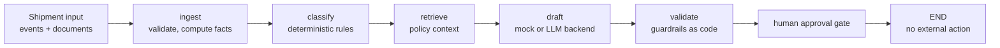

# Trida AI

## Blueprint — Logistics Shipment Exception Agent

It turns one shipment record into a classified exception, a policy-cited
customer-update draft, and a claim-packet draft — then waits for a human
decision.

<p>
  
  
  
</p>

> **Reference prototype.** An open blueprint from Trida AI showing how a
> forward-deployed engineering team builds an AI agent for a real
> operational workflow. It runs on **synthetic data only**, stops at a
> human-approval gate, and takes **no external action**. It is not a
> production system and does not describe any client engagement.

## Try it in 3 commands

Once the repository is cloned and dependencies are installed, the demo
and tests run locally with no API key. The primary workflow is
**[uv](https://docs.astral.sh/uv/)**, using the versions in `uv.lock`:

**Supported Python: 3.10 – 3.12** (macOS and Linux).

```bash
uv sync --extra dev              # 1 · install the locked set (uv.lock)
uv run shipment-agent-demo       # 2 · one shipment, end to end, with a trace
uv run pytest -q                 # 3 · the full test suite (48 tests)
```

No uv? Create a virtual environment and use pip. The direct dependencies
are pinned, and `constraints.txt` freezes the tested transitive set:

```bash
python3 -m venv .venv
source .venv/bin/activate
pip install -e ".[dev]" -c constraints.txt
python -m shipment_agent demo
pytest -q
```

Real excerpt from the demo's output:

```text
[2] CLASSIFICATION
    Exception : delay
    Severity  : high   Confidence: 0.94
    Evidence (signals):
      - delay signal: delay_hours=36.0
      - delay signal: delayed
      - delay signal: weather hold

[6] GUARDRAIL CHECKS
    [PASS] references_shipment_id — Draft references shipment SYN-1001.
    [PASS] no_prohibited_promises — No prohibited promise phrases found.
    [PASS] policy_citations_present — Cites 3 policy citation(s): POL-DELAY-01, POL-COMM-01, POL-DMG-01.
    [PASS] states_next_step — Draft states the next update / next step.
    Overall: PASSED

[7] FINAL STATE
    PENDING_HUMAN_APPROVAL
    approval_status = awaiting_approval · external_action_taken = False
```

Prefer a browser? Run `make serve` and
open http://localhost:8000/ — pick a sample shipment, click **Analyze**,
review the draft and guardrail checks, then **Approve** or **Reject**.
`make demo`, `make test`, `make evals`, and `make serve` wrap the common
commands.

## The problem

When a shipment goes wrong — it's delayed, damaged, its documents don't
agree, or a delivery appointment is missed — someone in operations has to
notice, work out which kind of exception it is, check the governing policy,
draft a correct customer update, and assemble a claim packet. Multiplied by
every exception, every day, that follow-through is where logistics teams
lose hours and consistency.

## What this agent does

For one shipment, end to end:

1. **Ingests** one shipment record as JSON: schedule, latest event,
   condition notes, and documents (bill of lading, invoice, tracking
   notes).
2. **Classifies** the exception — `delay`, `damage`, `document_mismatch`,
   `missed_appointment`, or `none` — with deterministic, auditable rules,
   and computes the facts (delay hours, field-level document mismatches)
   with code, never with a model.
3. **Retrieves** policy context from the synthetic SOP corpus behind a
   small retriever interface.
4. **Drafts** a customer update and a claim packet, with policy citations.
5. **Validates** the draft against guardrails implemented as code (no
   promised compensation, no missing citations, no missing shipment ID).
6. **Stops.** The result sits at `awaiting_approval`. Nothing is sent,
   filed, or posted anywhere — a human approves first.

## Who it's for

- **3PLs, carriers, and shipper operations teams** evaluating how an
  exception-handling agent should be structured before anyone builds one
  against real systems.
- **Engineers** who want a testable LangGraph reference implementation —
  graph, schemas, guardrails, evals, API, and tests — instead of a notebook.

## Take it and make it yours

Use these seams to adapt it — each is one file or one setting:

- **Real LLM drafting in the API** — install the optional SDKs
  (`uv sync --extra dev --extra llm`), set `MODEL_BACKEND=openai` or
  `anthropic` and the matching API key in the process environment before
  starting the API; the deterministic mock stays the default. The CLI and
  traced demo always use the mock. Backend interface:
  `src/shipment_agent/model_backends.py`.
- **Semantic retrieval** — implement the `Retriever` protocol in
  `src/shipment_agent/retriever.py` (e.g. LlamaIndex over a vector store);
  the graph doesn't change.
- **Your policy corpus** — replace the synthetic SOPs in
  `src/shipment_agent/policies_data.py` with your real exception-handling
  policies, and keep the mirror in `data/sample/policies.json` in sync.
- **A new exception type** — add the enum value in
  `src/shipment_agent/schemas.py`, a rule branch in
  `src/shipment_agent/classifier.py`, and golden cases in
  `evals/golden.jsonl`.
- **Real intake** — `POST /shipments/analyze` (FastAPI, `api.py`) accepts
  the same JSON shape a TMS or carrier webhook can produce; approvals are
  `POST /shipments/{id}/approve|reject` in `service.py`, where the action
  layer (send/file) plugs in behind the gate.

## Prerequisites

- **Python 3.10 – 3.12** (macOS and Linux).
- **[uv](https://docs.astral.sh/uv/) recommended** for install and running
  — or plain `pip` with a virtualenv (fallback path below).
- **Docker optional** — only for the Docker Compose deployment option.
- **No GPU required.** The agent is rules, retrieval, and drafting; it
  runs comfortably on a laptop CPU.
- **No API key needed** for the default deterministic mock backend. The
  optional LLM backends read `MODEL_BACKEND`, `OPENAI_API_KEY`, and
  `ANTHROPIC_API_KEY` from the process environment. `.env.example` lists
  the variable names; the application does not load a `.env` file
  automatically.

## Quickstart (no API key)

```bash
git clone https://github.com/tridaai/blueprint-logistics-shipment-exception.git
cd blueprint-logistics-shipment-exception

uv sync --extra dev                  # locked install from uv.lock

# Traced demo on one synthetic sample shipment
uv run shipment-agent-demo           # or: uv run python -m shipment_agent demo, or: make demo

# Batch CLI over all 12 bundled samples
uv run shipment-agent --all

# Demo console (API + web UI)
uv run uvicorn shipment_agent.api:app
# → Console: http://localhost:8000/   API docs: http://localhost:8000/docs

# Tests and evals
uv run pytest -q
uv run python evals/run_evals.py
```

**pip fallback** (no uv): `python3 -m venv .venv && source .venv/bin/activate`,
then `pip install -e ".[dev]" -c constraints.txt` and the same commands
without the `uv run` prefix. A plain `pip install .` also works: the
sample data ships inside the package, and the `shipment-agent` /
`shipment-agent-demo` console scripts are installed with it.

Or with Docker: `docker compose up --build` serves the API on port 8000.

After installation, the default **deterministic mock** backend makes no
external network calls. To use a real model in the API, install the `llm`
extra and set `MODEL_BACKEND=openai` or `anthropic` plus the matching API
key in the process environment before starting the API.

## Deployment options

Three ways to run the same code — all serve the demo console and API on
http://localhost:8000 (API docs at http://localhost:8000/docs).

**1 · Local with uv (recommended)**

```bash
uv sync --extra dev
uv run uvicorn shipment_agent.api:app --port 8000
```

**2 · Local with pip (fallback)**

```bash
python3 -m venv .venv && source .venv/bin/activate
pip install -e ".[dev]" -c constraints.txt
uvicorn shipment_agent.api:app --port 8000
```

**3 · Docker Compose**

```bash
docker compose up --build   # serves on port 8000, mock backend by default
docker compose down         # stop it
```

## Architecture



Full design — decisions, trade-offs, failure modes, security notes, and the
production path — is in [docs/architecture.md](docs/architecture.md).

## Eval results

Golden dataset: 32 synthetic cases in
[evals/golden.jsonl](evals/golden.jsonl), run with
`uv run python evals/run_evals.py`:

| Metric | Result |
|---|---|
| Exception-type accuracy | **32/32 = 100%** |
| Severity accuracy | **32/32 = 100%** |
| delay | 8/8 |
| damage | 7/7 |
| document_mismatch | 7/7 |
| missed_appointment | 5/5 |
| none | 5/5 |

Scope: this eval covers classification only; it does not score retrieval
or draft quality. The golden set is synthetic and covers the phrasings the
rule classifier is designed for, so it functions as a **regression gate**
(any change that breaks a known case fails the gate), not as a real-world
accuracy claim. When a new phrasing is missed, add it as a case before
changing the classifier; the case then guards the fix. Production accuracy
would be measured on real, consented, anonymised exception data.

Test suite: **48 tests, all passing** (`pytest -q`) — classifier, tools,
retriever, guardrails, end-to-end graph, API approval/reject flow, the web
UI, and a negation suite covering the inputs humans try first ("no damage
reported", "not damaged", "undamaged", "damage: none", "no discrepancy
found" — none of which may fire the rule they negate).

## Repository structure

```
src/shipment_agent/   agent graph, classifier, retriever, guardrails,
                      model backends (mock / OpenAI / Anthropic),
                      FastAPI app + web UI (static/), demo trace, CLI,
                      service layer, bundled samples (data/)
docs/architecture.md  full architecture and productionisation notes
data/sample/          synthetic shipments (12) + policy corpus mirror
evals/                golden dataset (32 cases) + run_evals.py
tests/                48 pytest tests: unit, integration, API, UI, negation
Makefile              make demo · make test · make evals · make serve
```

## Production hardening — what changes for a real deployment

This prototype deliberately omits, and a production build must add:
authenticated API and per-client data isolation; TMS/carrier event
integrations and OCR document extraction; semantic retrieval (LlamaIndex +
vector store) over real SOPs; an approval queue UI with a full audit log;
a post-approval action layer (messaging, claim filing) with idempotency
and rate limits; tracing/observability; and an eval set grown from real
approver corrections. Section 9 of the architecture doc covers each in
detail.

## Limitations

- Rule-based classification only recognises phrasings it knows; novel
  wording can be missed (classified `none`). It does handle negation
  ("no damage reported" is not damage) and recovery ("back on schedule"
  cancels a keyword delay, never a computed one) — both covered by tests.
- Keyword retrieval, not semantic search.
- Approvals are in-memory; nothing persists across restarts.
- No OCR, no carrier integration, no sending — by design.

## License

Apache License 2.0 — see [LICENSE](LICENSE).

Part of the **Trida AI Agent Blueprints** series: open reference
implementations for vertical AI agents.
